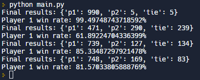

# Rock Paper Scissors

- This machine learning project plays rock paper scissors and learns player patterns.

# Live Version



# Running Locally

To run this locally, run the following commands in a terminal:

```
python main.py
```

# Requirements

- In the file RPS.py you are provided with a function called player. The function takes an argument that is a string describing the last move of the opponent ("R", "P", or "S"). The function should return a string representing the next move for it to play ("R", "P", or "S").
- A player function will receive an empty string as an argument for the first game in a match since there is no previous play.
- The file RPS.py shows an example function that you will need to update. The example function is defined with two arguments (player(prev_play, opponent_history = [])). The function is never called with a second argument so that one is completely optional. The reason why the example function contains a second argument (opponent_history = []) is because that is the only way to save state between consecutive calls of the player function. You only need the opponent_history argument if you want to keep track of the opponent_history.


To test your code, play a game with the play function. The play function takes four arguments:

- two players to play against each other (the players are actually functions)
- the number of games to play in the match
- an optional argument to see a log of each game. Set it to True to see these messages.

```
play(player1, player2, num_games[, verbose])
```
For example, here is how you would call the function if you want player and quincy to play 1000 games against each other and you want to see the results of each game:

```
play(player, quincy, 1000, verbose=True)
```